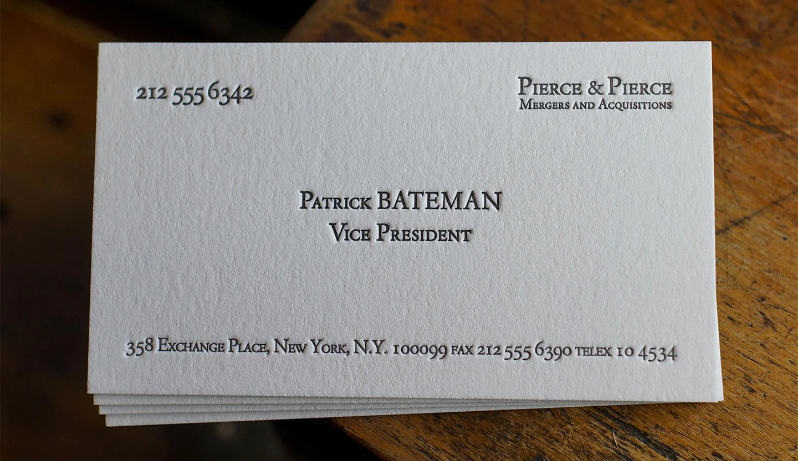
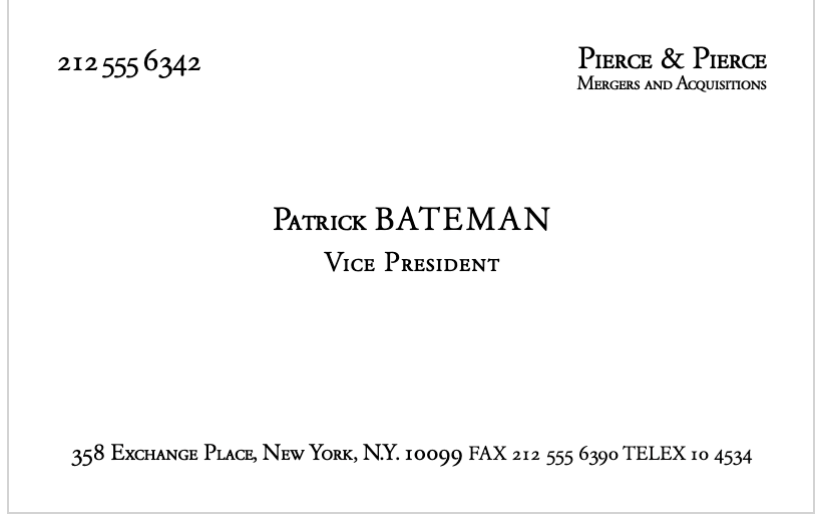

# Business Card Generator in Typst

A Typst template for generating elegant business cards, inspired by the iconic business card scene from American Psycho. 

> Look at that subtle off-white coloring. The tasteful thickness of it. Oh my God, it even has a watermark.
## Prerequisites

- [Typst](https://typst.app/) installed on your system

## Usage

1. Clone this repository
2. Modify `main.typ` with your information:
3. Run `typst compile main.typ` to generate the business card.

## Reference
### Original

### Typst 
